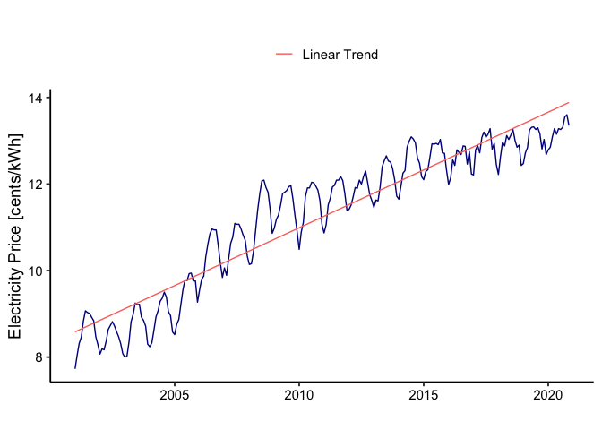
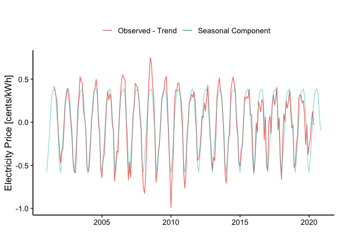

TSA: Trend and Seasonality - Electricity Price Modeling
================
Luana Lima
15/06/2023

## Loading packages and initializing

It’s useful to designate one code chunk to load packages on the
beginning of the file. You can always add to this chunk as needed. But
concentrate the packages needed on only one chunk. By setting message =
FALSE and warning = FALSE, the code will run but nothing will be
printed.

``` r
library(tidyverse)
library(lubridate)
library(forecast)

mytheme <- theme_classic(base_size = 14) +
  theme(axis.text = element_text(color = "black"), 
        legend.position = "top") 
theme_set(mytheme)
```

## Importing data

For this module we will work with monthly average for electricity retail
price in US. The data is from the U.S. Energy Information Administration
and can be download
\[here\]\[<https://www.eia.gov/electricity/data/browser/#/topic/7?agg=2,0,1&geo=g&freq=M%2013:41:41%20GMT-0500%20(EST)>\].

The original file was imported and cleaned/wrangled in “ImportData.Rmd”.
Here we are just reading the data already processed and ready to be used
for time series analysis. To import the .csv file we will use
*read.csv()*. This function will store the data as a data frame and has
useful inputs such as

- *file = * : use this input to point to yoru data file. If it’s on the
  same folder as your .Rmd then you only need to write the file name.
  But if it’s on another folder you need to point to the path were file
  is located;
- *header =* : if your file has a header you should set this to TRUE,
  o.w. FALSE;
- *skip =* : if your file has rows explaining the data or any other rows
  on the top that need to be skipped you should just set skip to be
  equal to the number of row that should be skipped before reading the
  data. Mote that if header=TRUE, you should not skip the row with the
  header. The default is *skip=0*;
- *dec =* : define *dec=“.”* or *dec=“,”* depending on how it’s defined
  on your set. The default is “.”.

``` r
#Importing time series data from csv file#
original_data <- read.csv("./Data/Processed/ElectricityPrice.csv")

nobs <- nrow(original_data)
head(original_data,10)
```

    ##          Date Residential
    ## 1  2001-01-01        7.73
    ## 2  2001-02-01        8.04
    ## 3  2001-03-01        8.32
    ## 4  2001-04-01        8.46
    ## 5  2001-05-01        8.83
    ## 6  2001-06-01        9.07
    ## 7  2001-07-01        9.03
    ## 8  2001-08-01        9.01
    ## 9  2001-09-01        8.92
    ## 10 2001-10-01        8.84

## Transforming data into time series object

Many of the functions we will use require a time series object. You can
transform your data in a time series using the function *ts()*.

``` r
year1 <- year(original_data$Date[1])
month1 <- month(original_data$Date[1])
ts_original_data <- ts(original_data$Residential,start=c(year1,month1),frequency=12) 
ts_original_data
```

    ##        Jan   Feb   Mar   Apr   May   Jun   Jul   Aug   Sep   Oct   Nov   Dec
    ## 2001  7.73  8.04  8.32  8.46  8.83  9.07  9.03  9.01  8.92  8.84  8.47  8.29
    ## 2002  8.07  8.19  8.17  8.37  8.64  8.73  8.82  8.72  8.59  8.47  8.31  8.08
    ## 2003  8.00  8.02  8.35  8.82  8.99  9.25  9.21  9.22  8.92  8.85  8.72  8.30
    ## 2004  8.24  8.33  8.62  8.93  9.07  9.29  9.36  9.50  9.39  9.05  8.96  8.58
    ## 2005  8.52  8.76  8.87  9.22  9.56  9.79  9.77  9.93  9.94  9.76  9.76  9.27
    ## 2006  9.55  9.80  9.87 10.32 10.61 10.85 10.96 10.94 10.94 10.58 10.18  9.84
    ## 2007 10.06  9.89 10.27 10.63 10.77 11.09 11.07 11.07 10.96 10.82 10.70 10.33
    ## 2008 10.14 10.16 10.45 10.93 11.40 11.77 12.07 12.09 11.92 11.81 11.42 10.86
    ## 2009 10.98 11.18 11.28 11.50 11.78 11.81 11.85 11.94 11.96 11.65 11.26 10.90
    ## 2010 10.49 10.89 11.11 11.71 11.91 11.91 12.04 12.03 11.95 11.86 11.62 11.06
    ## 2011 10.87 11.06 11.52 11.67 11.93 11.97 12.09 12.09 12.17 12.08 11.78 11.40
    ## 2012 11.41 11.51 11.70 11.92 11.90 12.09 12.00 12.17 12.30 12.03 11.75 11.62
    ## 2013 11.46 11.63 11.61 11.93 12.40 12.54 12.65 12.53 12.51 12.36 12.10 11.72
    ## 2014 11.65 11.94 12.25 12.31 12.85 12.99 13.09 13.04 12.95 12.60 12.48 12.17
    ## 2015 12.10 12.29 12.33 12.62 12.93 12.92 12.94 12.91 13.03 12.72 12.71 12.32
    ## 2016 11.99 12.14 12.56 12.43 12.79 12.73 12.68 12.88 12.87 12.46 12.75 12.23
    ## 2017 12.21 12.79 12.89 12.72 13.07 13.20 13.08 13.15 13.28 12.80 12.94 12.45
    ## 2018 12.22 12.63 12.97 12.88 13.12 13.03 13.13 13.26 13.01 12.85 12.90 12.43
    ## 2019 12.47 12.72 12.84 13.25 13.31 13.32 13.26 13.30 13.16 12.81 13.03 12.68
    ## 2020 12.79 12.85 13.09 13.28 13.15 13.28 13.26 13.31 13.55 13.60 13.35

Note that ts_original_data has information on start, end and frequency.

## Initial Plots

Initial time series plot. We will use the ggplot environment adapted for
time series data by package *forecast*. It tries give better default
graphics and customized choices for time series objects. The equivalent
of *ggplot()* for time series data is *autoplot()* and we will use
*autolayer()* to add more than one series to the same plot.

``` r
autoplot(ts_original_data, color="darkblue") +
    ylab("Electricity Price [cents/kWh]") +
    xlab("")
```

<!-- -->

## Trend Component

Let’s identify and remove trend component like we leaned in class. Start
by fitting a linear trend model to $Y_t=\beta_0+\beta_1*t+\epsilon_t$.

``` r
#create vector t
t <- c(1:nobs)

#combine t and original into one data frame
data <- data.frame("t"=t,"original"=original_data$Residential)

#Fit a linear trend to TS, lm function needs a data frame object
linear_trend_model=lm(original~t,data)  
summary(linear_trend_model)
```

    ## 
    ## Call:
    ## lm(formula = original ~ t, data = data)
    ## 
    ## Residuals:
    ##     Min      1Q  Median      3Q     Max 
    ## -1.1456 -0.3733 -0.0647  0.4086  1.4820 
    ## 
    ## Coefficients:
    ##              Estimate Std. Error t value Pr(>|t|)    
    ## (Intercept) 8.5617584  0.0723760  118.30   <2e-16 ***
    ## t           0.0222667  0.0005229   42.59   <2e-16 ***
    ## ---
    ## Signif. codes:  0 '***' 0.001 '**' 0.01 '*' 0.05 '.' 0.1 ' ' 1
    ## 
    ## Residual standard error: 0.5577 on 237 degrees of freedom
    ## Multiple R-squared:  0.8844, Adjusted R-squared:  0.8839 
    ## F-statistic:  1814 on 1 and 237 DF,  p-value: < 2.2e-16

``` r
#first coefficient is the intercept term or beta0
beta0=as.numeric(linear_trend_model$coefficients[1])  

#second coefficient is the slope or beta1
beta1=as.numeric(linear_trend_model$coefficients[2])  
```

Note that coefficients for the linear trend, beta 1 have a p-value
greater than 0.05, which means the coefficient is not significant. Let’s
visualize this.

``` r
#create linear trend series
linear_trend <- (beta0+beta1*t)
ts_linear_trend <- ts(linear_trend,start=c(year1,month1),frequency=12) 

#visualize the trend on observed data
autoplot(ts_original_data, color="darkblue") +
  autolayer(ts_linear_trend,series="Linear Trend") +
  ylab("Electricity Price [cents/kWh]") +
  xlab("") +
  labs(color="")
```

<!-- -->

\##Smoothing out the trend

Since the overall linear trend was not significant, let’s try the
rolling average method. We have monthly data so our frequency is 12. We
will use a moving average of order 12 to remove the seasonal influence
from trend analysis.

``` r
order <- 6 #frequency = 12
smooth_trend <- array(NA,nobs)
for(t in (order+1):(nobs)){
  smooth_trend[t] = mean(original_data$Residential[(t-order+1):(t+order)])
}
  
ts_smooth_trend <- ts(smooth_trend,start=c(year1,month1),frequency=12) 

autoplot(ts_original_data, col="darkblue") +
  autolayer(ts_linear_trend,series="Linear Trend" ) +
  autolayer(ts_smooth_trend,series="Smooth Trend" ) +
  ylab("Electricity Price [cents/kWh]") +
  xlab("") +
  labs(color="")
```

<!-- -->

## Detrend Series

Now let’s remove the rolling average trend from the original series.

``` r
#Create detrended series from linear trend
detrend_linear <- original_data$Residential-(beta0+beta1*data$t)   
year1 <- year(original_data$Date[1])
month1 <- month(original_data$Date[1])
ts_detrend_linear <- ts(detrend_linear,start=c(year1,month1),frequency=12) 

#Create detrended series from rolling average trend - that the we will use
detrend_smooth <- original_data$Residential - smooth_trend
ts_detrend_smooth <- ts_original_data-ts_smooth_trend

autoplot(ts_original_data, col="darkblue") +
  autolayer(ts_detrend_smooth,series="Detrended Series" ) +
  ylab("Electricity Price [cents/kWh]") +
  xlab("") +
  labs(color="")
```

<!-- -->

## Seasonal Component

Now let’s shift attention to the seasonal component. We will fit a
Seasonal Means Model to our detrended data.

``` r
#First create the seasonal dummies
dummies <- seasonaldummy(ts_detrend_smooth)  #this function only accepts ts object

#Then fit a linear model to the seasonal dummies
seas_means_model=lm(detrend_smooth~dummies)
summary(seas_means_model)
```

    ## 
    ## Call:
    ## lm(formula = detrend_smooth ~ dummies)
    ## 
    ## Residuals:
    ##      Min       1Q   Median       3Q      Max 
    ## -0.41044 -0.08610  0.00579  0.08325  0.41956 
    ## 
    ## Coefficients:
    ##             Estimate Std. Error t value Pr(>|t|)    
    ## (Intercept) -0.49557    0.03198 -15.494  < 2e-16 ***
    ## dummiesJan  -0.08750    0.04523  -1.934   0.0544 .  
    ## dummiesFeb   0.08101    0.04523   1.791   0.0747 .  
    ## dummiesMar   0.26965    0.04523   5.961 1.01e-08 ***
    ## dummiesApr   0.49561    0.04523  10.957  < 2e-16 ***
    ## dummiesMay   0.72368    0.04523  15.999  < 2e-16 ***
    ## dummiesJun   0.84284    0.04586  18.380  < 2e-16 ***
    ## dummiesJul   0.86741    0.04523  19.177  < 2e-16 ***
    ## dummiesAug   0.88211    0.04523  19.502  < 2e-16 ***
    ## dummiesSep   0.80803    0.04523  17.864  < 2e-16 ***
    ## dummiesOct   0.55689    0.04523  12.312  < 2e-16 ***
    ## dummiesNov   0.40320    0.04523   8.914  < 2e-16 ***
    ## ---
    ## Signif. codes:  0 '***' 0.001 '**' 0.01 '*' 0.05 '.' 0.1 ' ' 1
    ## 
    ## Residual standard error: 0.1394 on 215 degrees of freedom
    ##   (12 observations deleted due to missingness)
    ## Multiple R-squared:  0.8618, Adjusted R-squared:  0.8547 
    ## F-statistic: 121.8 on 11 and 215 DF,  p-value: < 2.2e-16

``` r
#Look at the regression coefficient. These will be the values of Beta

#Store regression coefficients
beta_int=seas_means_model$coefficients[1]
beta_coeff=seas_means_model$coefficients[2:12]
```

``` r
#compute seasonal component
seas_component=array(0,nobs)
for(i in 1:nobs){
  seas_component[i]=(beta_int+beta_coeff%*%dummies[i,])
}

#Transform into a ts object
ts_seasonal_component <- ts(seas_component,start=c(year1,month1),frequency=12) 

#Understanding what we did
autoplot(ts_detrend_smooth,series="Observed - Trend") +
  autolayer(ts_seasonal_component,series="Seasonal Component",alpha=0.5) +
  ylab("Electricity Price [cents/kWh]") +
  xlab("") +
  labs(color="")
```

<!-- -->

## Combine Seasonal and Trend

Now let’s add seasonal and trend component and see how it maps onto
orignal data series.

``` r
#Create seasonal + trend object
ts_seasonal_trend <- ts_seasonal_component + ts_smooth_trend 

#Understanding what we did
autoplot(ts_original_data, color="darkblue") +
  autolayer(ts_seasonal_trend,series="Seasonal + Trend", alpha=0.7) +
  ylab("Electricity Price [cents/kWh]") +
  xlab("") +
  labs(color="")
```

<!-- -->

## Decompose and Forecast

Now that you understand the principle, there are functions in R that
will automatically decompose your time series data like the
*decompose()* and the *stl()* from the *stats* package. This functions
only take time series objects. They will decompose your time series into
three components: trend, seasonal and random. This is similar to what we
did in the script, but in a more automated way. The random component is
the time series without seasonal and trend component.

``` r
decompose <- decompose(ts_original_data,"additive") 
plot(decompose)
```

<!-- -->

``` r
decompose <- stl(ts_original_data,s.window="periodic")
plot(decompose)
```

<!-- -->

## Forecast with seasonal trend model

``` r
fit <- stl(ts_original_data,s.window="periodic")

original_forecast <- forecast(fit, h=48)

autoplot(original_forecast) + 
  ylab("Electricity Price [cents/kWh]") + 
  ggtitle("Forecast with Seasonal Trend Model")
```

<!-- -->
