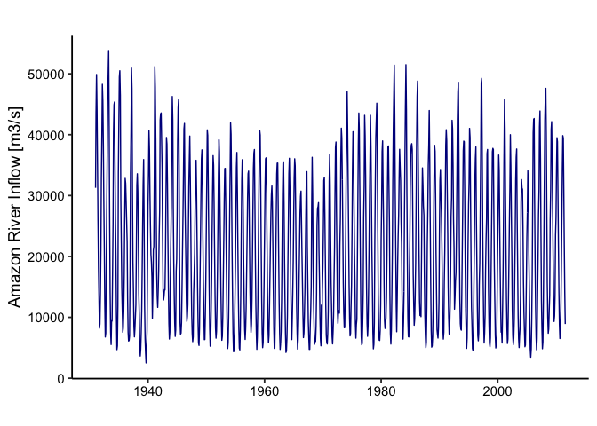
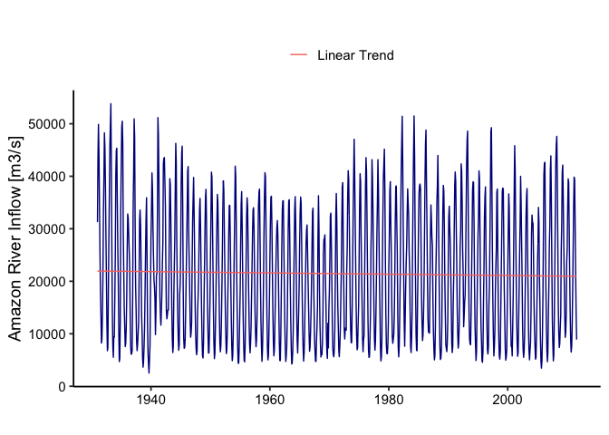
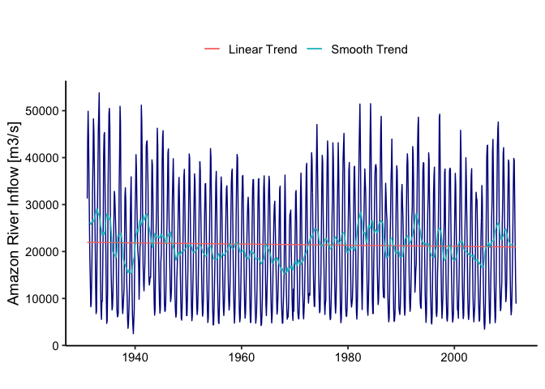
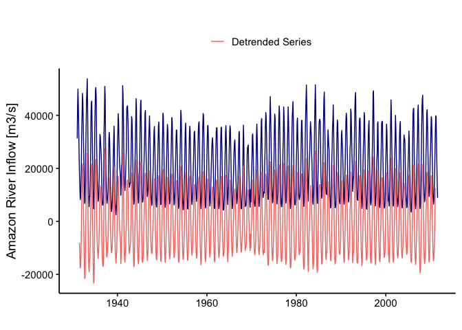
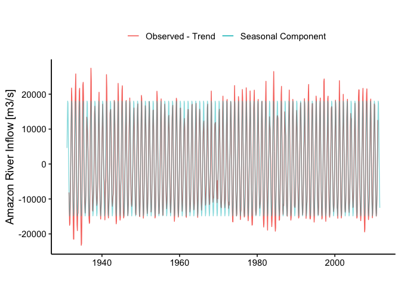
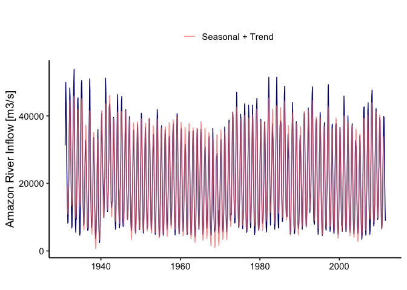
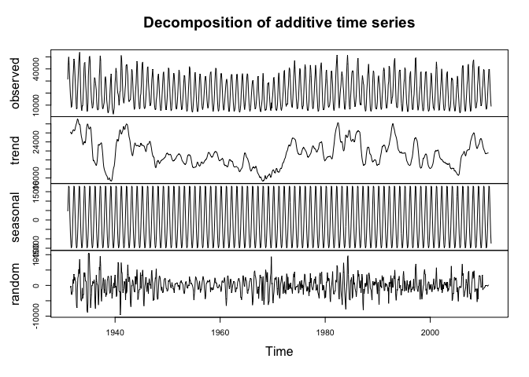
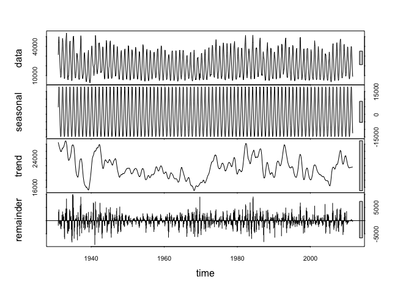
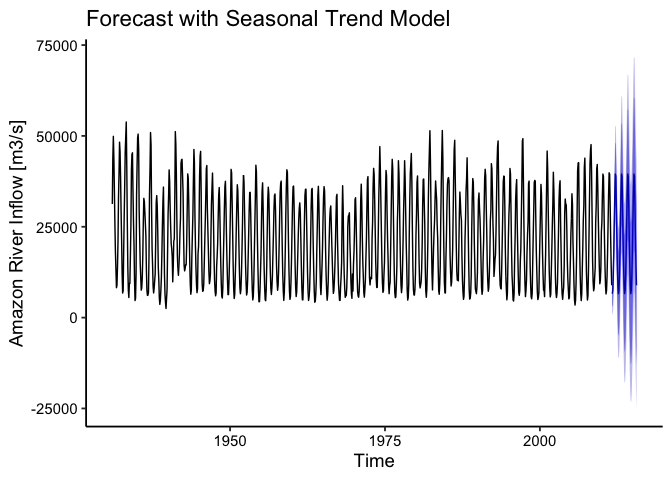

TSA: Trend and Seasonality - Amazon Inflow Modeling
================
Luana Lima
15/06/2023

## Loading packages and initializing

It’s useful to designate one code chunk to load packages on the
beginning of the file. You can always add to this chunk as needed. But
concentrate the packages needed on only one chunk. By setting message =
FALSE and warning = FALSE, the code will run but nothing will be
printed.

``` r
library(tidyverse)
library(lubridate)
library(forecast)

mytheme <- theme_classic(base_size = 14) +
  theme(axis.text = element_text(color = "black"), 
        legend.position = "top") 
theme_set(mytheme)
```

## Importing data

For this first example we will import water inflow data for reservoirs
in Brazil. The original file was imported and cleaned/wrangled in
“ImportData.Rmd”. Here we are just reading the data already processed
and ready to be used for time series analysis. To import the .csv file
we will use *read.csv()*. This function will store the data as a data
frame and has useful inputs such as

- *file = * : use this input to point to yoru data file. If it’s on the
  same folder as your .Rmd then you only need to write the file name.
  But if it’s on another folder you need to point to the path were file
  is located;
- *header =* : if your file has a header you should set this to TRUE,
  o.w. FALSE;
- *skip =* : if your file has rows explaining the data or any other rows
  on the top that need to be skipped you should just set skip to be
  equal to the number of row that should be skipped before reading the
  data. Mote that if header=TRUE, you should not skip the row with the
  header. The default is *skip=0*;
- *dec =* : define *dec=“.”* or *dec=“,”* depending on how it’s defined
  on your set. The default is “.”.

``` r
#Importing time series data from csv file#
original_data <- read.csv("./Data/Processed/AmazonInflow.csv")

nobs <- nrow(original_data)
head(original_data,10)
```

    ##          Date Amazon.River
    ## 1  1931-01-01        31270
    ## 2  1931-02-01        43827
    ## 3  1931-03-01        49884
    ## 4  1931-04-01        43962
    ## 5  1931-05-01        35156
    ## 6  1931-06-01        25764
    ## 7  1931-07-01        18109
    ## 8  1931-08-01        13320
    ## 9  1931-09-01         8225
    ## 10 1931-10-01         8900

## Transforming data into time series object

Many of the functions we will use require a time series object. You can
transform your data in a time series using the function *ts()*.

``` r
year1 <- year(original_data$Date[1])
month1 <- month(original_data$Date[1])
ts_original_data <- ts(original_data$Amazon.River,start=c(year1,month1),frequency=12) 
ts_original_data
```

    ##        Jan   Feb   Mar   Apr   May   Jun   Jul   Aug   Sep   Oct   Nov   Dec
    ## 1931 31270 43827 49884 43962 35156 25764 18109 13320  8225  8900 13766 20880
    ## 1932 33160 39791 48274 45604 38578 29111 21390 12128  6763  7401 18222 27918
    ## 1933 36329 45715 49776 53821 41418 26486 14022  7595  5530  9445  9375 16806
    ## 1934 25239 40503 44913 45356 35111 26370 20012 10434  4687  5310 11959 34043
    ## 1935 42189 49476 50502 46586 29405 22169 14909 11234  7555  8206 10985 16850
    ## 1936 26190 32822 31995 29034 25887 22486 13137  7556  6106  6177  6950 16654
    ## 1937 33902 40777 50936 47561 30494 19004 14333  8465  6781  8094 10059 12026
    ## 1938 21011 31748 33576 30698 23528 13872 10491  5490  3635  4763  7456 10985
    ## 1939 17746 25489 31942 35918 24789 11898  6436  4149  2505  5164  7726 17943
    ## 1940 28519 33502 40638 37546 30350 24917 20356 19034 16681  9842 14002 21041
    ## 1941 21623 33152 51180 47786 39419 26823 17026 13442 11632 14352 17638 23417
    ## 1942 27441 42441 43420 43570 39155 34414 22925 14421 12849 13495 14550 14493
    ## 1943 20303 29763 39542 38468 32102 23004 14827  8976  6432  7586 16558 22631
    ## 1944 28127 37723 46270 42516 27966 19548 13403  9036  6861  7927 17639 19575
    ## 1945 27119 39068 44423 45750 35054 18608  9199  7235  7393  9068 14475 20877
    ## 1946 26622 33532 40960 41852 30138 24457 18721 12637  9337 10130 12063 22825
    ## 1947 31394 35644 39775 33204 25605 16138 10305  7304  6001  6786 13977 16879
    ## 1948 20483 27636 33670 35795 30494 22629 14938  9287  5787  5379  8189 15893
    ## 1949 22610 30157 36050 37509 31533 22963 15688 10245  6331  6349 10378 16011
    ## 1950 24309 32502 40791 39889 32135 23617 14427  8102  5256  6318 11077 16397
    ## 1951 24208 30974 36560 34998 28788 21035 13520  8224  6571  7676 11790 17856
    ## 1952 25372 33785 39203 37244 29730 22678 14708  9620  6223  6909 10177 16263
    ## 1953 22694 29537 34429 34468 28545 20463 13222  7665  4867  5816  9932 17675
    ## 1954 25773 33421 41934 40076 31723 21495 13545  7428  4361  4398  7484 12775
    ## 1955 18111 27706 34706 37078 30575 21498 13477  8193  4926  4641  7771 14190
    ## 1956 23813 32488 35891 34051 27157 18636 12253  7954  6362  8182 11453 17344
    ## 1957 23199 29703 33592 34014 29618 21503 14153  9933  7524  8838 12826 19643
    ## 1958 27819 34520 36974 37563 29090 19585 12014  7492  4739  6830 11575 19180
    ## 1959 28831 36243 40681 39951 31823 21448 13267  7345  5015  5835 10018 16134
    ## 1960 24059 31462 36039 36199 30721 22291 14126  8336  5798  6960 11317 16598
    ## 1961 22248 27048 30134 31566 28917 21973 14466  8276  4896  4889  9696 18011
    ## 1962 26609 33559 35322 35336 28385 20073 12394  7377  4722  5685  7664 12712
    ## 1963 21256 30272 35326 35538 28718 20138 12969  7349  4233  4462  6476 10311
    ## 1964 18721 25838 33635 36124 31489 23253 14673  8644  6338  9719 13994 19129
    ## 1965 26944 33119 36041 34905 27776 18639 11589  7374  4788  6242  9670 16071
    ## 1966 21755 27194 29859 30730 25719 20287 15300 10374  6662  7419 10199 14194
    ## 1967 20130 27009 33240 33930 21763 15620  9363  6777  4734  4735  8481 11160
    ## 1968 15080 28418 36290 30138 18590 11958  8071  5577  6379  6019  8409 13741
    ## 1969 25171 27930 28139 28840 20857 16168  9962  6476  5316 11998  7303 14615
    ## 1970 18174 24452 32471 32989 27259 19996 11824  7093  5927  5614  7243 10877
    ## 1971 20761 32350 36718 31797 22730 15525 11277  6852  5630  7608 10249 16101
    ## 1972 21386 30602 37935 38796 27278 19468 10955  9005 10744 11133 10689 21826
    ## 1973 26278 36225 41067 39427 32626 24577 15578 10680  8286  8315 14459 23252
    ## 1974 33162 39892 47051 40796 32230 23881 15422  9731  6946  7367 11724 15244
    ## 1975 23684 34335 40489 39062 29085 21570 15978  8986  6577  8818  9665 18966
    ## 1976 29005 38528 43554 40851 31415 21368 12194  6820  5489  5682  9075 13895
    ## 1977 26588 31463 43171 39870 33446 22484 14605  8957  6873  8518 13838 20897
    ## 1978 29249 35474 43171 38087 29566 20906 14853  7604  4824  5548  9044 22898
    ## 1979 32479 39647 42441 45169 37715 24722 13794  7916  6255  6191  7789 12047
    ## 1980 22809 28565 37262 38979 30975 25239 15564  9459  8169  8972  9885 13206
    ## 1981 20010 31257 37999 38152 31616 25723 13826  7316  5601  7750 13377 20579
    ## 1982 32712 40800 46295 51421 43113 30562 21329 12158  7625 12805 18900 23389
    ## 1983 26812 32856 37597 34910 32515 25677 22032 13931  7446  6419  9145 14213
    ## 1984 27300 36965 44965 51491 44278 29863 18606  9694  6814  6768 16296 22368
    ## 1985 31287 36748 38263 38527 37571 27445 17073 12391  8698  9680 13472 18667
    ## 1986 28717 39063 46290 48801 38759 30291 20225 12741 10296 11475 10106 18999
    ## 1987 28688 34544 31841 28282 26790 16708 10363  7060  5021  5886 11445 21918
    ## 1988 27452 35011 38224 43966 35951 25578 15666  7800  5099  5286  6814 11610
    ## 1989 24624 33323 38263 37268 30421 20482 13750  7959  7199  6587  8288 12492
    ## 1990 24059 32432 34286 30163 27195 22063 15071  8274  6415  7520 15925 21000
    ## 1991 29913 38284 40816 39010 30959 23967 14883 10000  7260  8133 11759 17045
    ## 1992 26701 29626 42361 40993 34892 26081 21507 11338 13251 15944 17341 23871
    ## 1993 32740 42492 47012 48609 37189 22831 12966  8966  8058  7889 13613 20880
    ## 1994 28432 37379 38944 38846 30900 19005 11421  7740  4891  6608 14589 22490
    ## 1995 28582 32105 41036 39567 29673 19196 11655  8682  4863  4556  6626 15517
    ## 1996 22208 32477 36116 37984 26529 19065 11821  6961  6142  7478 15382 18848
    ## 1997 27490 36688 48533 49259 38188 25810 15955  9421  5773  7436 10427 17903
    ## 1998 22790 26254 36921 37570 24645 14575  9072  5724  5164  6650 14681 22407
    ## 1999 29358 37206 37758 37559 27296 18259 12603  7065  4963  5539  6891 14809
    ## 2000 22107 29247 36651 34089 25821 18007 12027  7557  7670  5777 11116 17269
    ## 2001 26835 36764 45828 41038 30282 21745 13040  8204  5697  6429 12473 18447
    ## 2002 25356 31078 39996 35027 27575 20372 11153  7020  5519  6563  9518 16380
    ## 2003 23553 32547 36319 37651 26376 18267 10274  6488  5029  6888  8393 14285
    ## 2004 28901 32620 31225 31042 24951 15966 10793  7711  5159  5424  9656 16103
    ## 2005 23242 27204 34070 31232 20811 15307  8992  4820  3449  4742  9516 16836
    ## 2006 28607 40407 42531 42658 28826 18517 11419  6766  4675  6499 13263 19300
    ## 2007 26840 30748 41345 43887 36150 23392 12742  8168  4838  5956 12880 22223
    ## 2008 32493 42492 46138 47613 40093 28051 15616 10012  7378  8083 11131 13617
    ## 2009 26184 31029 40892 42138 36104 27713 20302 13772  9316 10225 13586 23583
    ## 2010 26337 34045 39501 38851 30495 21687 14043  8815  6512  7492 11387 17839
    ## 2011 26019 34143 39843 39441 31023 21840 14162  8896

Note that ts_original_data has information on start, end and frequency.

## Initial Plots

Initial time series plot. We will use the ggplot environment adapted for
time series data by package *forecast*. It tries give better default
graphics and customized choices for time series objects. The equivalent
of *ggplot()* for time series data is *autoplot()* and we will use
*autolayer()* to add more than one series to the same plot.

``` r
autoplot(ts_original_data, color="darkblue") +
    ylab("Amazon River Inflow [m3/s]") +
    xlab("")
```

<!-- -->

## Trend Component

Let’s identify and remove trend component like we leaned in class. Start
by fitting a linear trend model to $Y_t=\beta_0+\beta_1*t+\epsilon_t$.

``` r
#create vector t
t <- c(1:nobs)

#combine t and original into one data frame
data <- data.frame("t"=t,"original"=original_data$Amazon.River)

#Fit a linear trend to TS, lm function needs a data frame object
linear_trend_model=lm(original~t,data)  
summary(linear_trend_model)
```

    ## 
    ## Call:
    ## lm(formula = original ~ t, data = data)
    ## 
    ## Residuals:
    ##    Min     1Q Median     3Q    Max 
    ## -19337 -11555  -1483  10061  31900 
    ## 
    ## Coefficients:
    ##              Estimate Std. Error t value Pr(>|t|)    
    ## (Intercept) 21949.403    797.962  27.507   <2e-16 ***
    ## t              -1.024      1.427  -0.718    0.473    
    ## ---
    ## Signif. codes:  0 '***' 0.001 '**' 0.01 '*' 0.05 '.' 0.1 ' ' 1
    ## 
    ## Residual standard error: 12400 on 966 degrees of freedom
    ## Multiple R-squared:  0.0005328,  Adjusted R-squared:  -0.0005018 
    ## F-statistic: 0.515 on 1 and 966 DF,  p-value: 0.4732

``` r
#first coefficient is the intercept term or beta0
beta0=as.numeric(linear_trend_model$coefficients[1])  

#second coefficient is the slope or beta1
beta1=as.numeric(linear_trend_model$coefficients[2])  
```

Note that coefficients for the linear trend, beta 1 have a p-value
greater than 0.05, which means the coefficient is not significant. Let’s
visualize this.

``` r
#create linear trend series
linear_trend <- (beta0+beta1*t)
ts_linear_trend <- ts(linear_trend,start=c(year1,month1),frequency=12) 

#visualize the trend on observed data
autoplot(ts_original_data, color="darkblue") +
  autolayer(ts_linear_trend,series="Linear Trend") +
  ylab("Amazon River Inflow [m3/s]") +
  xlab("") +
  labs(color="")
```

<!-- -->

\##Smoothing out the trend

Since the overall linear trend was not significant, let’s try the
rolling average method. We have monthly data so our frequency is 12. We
will use a moving average of order 12 to remove the seasonal influence
from trend analysis.

``` r
order <- 6 #frequency = 12
smooth_trend <- array(NA,nobs)
for(t in (order+1):(nobs)){
  smooth_trend[t] = mean(original_data$Amazon.River[(t-order+1):(t+order)])
}
  
ts_smooth_trend <- ts(smooth_trend,start=c(year1,month1),frequency=12) 

autoplot(ts_original_data, col="darkblue") +
  autolayer(ts_linear_trend,series="Linear Trend" ) +
  autolayer(ts_smooth_trend,series="Smooth Trend" ) +
  ylab("Amazon River Inflow [m3/s]") +
  xlab("") +
  labs(color="")
```

<!-- -->

## Detrend Series

Now let’s remove the rolling average trend from the original series.

``` r
#Create detrended series from linear trend
detrend_linear <- original_data$Amazon.River-(beta0+beta1*data$t)   
year1 <- year(original_data$Date[1])
month1 <- month(original_data$Date[1])
ts_detrend_linear <- ts(detrend_linear,start=c(year1,month1),frequency=12) 

#Create detrended series from rolling average trend - that the we will use
detrend_smooth <- original_data$Amazon.River - smooth_trend
ts_detrend_smooth <- ts_original_data-ts_smooth_trend

autoplot(ts_original_data, col="darkblue") +
  autolayer(ts_detrend_smooth,series="Detrended Series" ) +
  ylab("Amazon River Inflow [m3/s]") +
  xlab("") +
  labs(color="")
```

<!-- -->

## Seasonal Component

Now let’s shift attention to the seasonal component. We will fit a
Seasonal Means Model to our detrended data.

``` r
#First create the seasonal dummies
dummies <- seasonaldummy(ts_detrend_smooth)  #this function only accepts ts object

#Then fit a linear model to the seasonal dummies
seas_means_model=lm(detrend_smooth~dummies)
summary(seas_means_model)
```

    ## 
    ## Call:
    ## lm(formula = detrend_smooth ~ dummies)
    ## 
    ## Residuals:
    ##    Min     1Q Median     3Q    Max 
    ##  -9430  -1552    -50   1654  10797 
    ## 
    ## Coefficients:
    ##             Estimate Std. Error t value Pr(>|t|)    
    ## (Intercept)  -3545.7      307.4 -11.533   <2e-16 ***
    ## dummiesJan    8131.5      434.8  18.702   <2e-16 ***
    ## dummiesFeb   15948.6      434.8  36.682   <2e-16 ***
    ## dummiesMar   21556.7      436.2  49.424   <2e-16 ***
    ## dummiesApr   20984.3      436.2  48.112   <2e-16 ***
    ## dummiesMay   12870.3      436.2  29.508   <2e-16 ***
    ## dummiesJun    3959.1      436.2   9.077   <2e-16 ***
    ## dummiesJul   -3731.7      434.8  -8.583   <2e-16 ***
    ## dummiesAug   -8994.6      434.8 -20.688   <2e-16 ***
    ## dummiesSep  -11306.9      434.8 -26.006   <2e-16 ***
    ## dummiesOct  -10378.9      434.8 -23.872   <2e-16 ***
    ## dummiesNov   -6515.4      434.8 -14.986   <2e-16 ***
    ## ---
    ## Signif. codes:  0 '***' 0.001 '**' 0.01 '*' 0.05 '.' 0.1 ' ' 1
    ## 
    ## Residual standard error: 2750 on 944 degrees of freedom
    ##   (12 observations deleted due to missingness)
    ## Multiple R-squared:  0.9478, Adjusted R-squared:  0.9472 
    ## F-statistic:  1558 on 11 and 944 DF,  p-value: < 2.2e-16

``` r
#Look at the regression coefficient. These will be the values of Beta

#Store regression coefficients
beta_int=seas_means_model$coefficients[1]
beta_coeff=seas_means_model$coefficients[2:12]
```

``` r
#compute seasonal component
seas_component=array(0,nobs)
for(i in 1:nobs){
  seas_component[i]=(beta_int+beta_coeff%*%dummies[i,])
}

#Transform into a ts object
ts_seasonal_component <- ts(seas_component,start=c(year1,month1),frequency=12) 

#Understanding what we did
autoplot(ts_detrend_smooth,series="Observed - Trend") +
  autolayer(ts_seasonal_component,series="Seasonal Component",alpha=0.5) +
  ylab("Amazon River Inflow [m3/s]") +
  xlab("") +
  labs(color="")
```

<!-- -->

## Combine Seasonal and Trend

Now let’s add seasonal and trend component and see how it maps onto
orignal data series.

``` r
#Create seasonal + trend object
ts_seasonal_trend <- ts_seasonal_component + ts_smooth_trend 

#Understanding what we did
autoplot(ts_original_data, color="darkblue") +
  autolayer(ts_seasonal_trend,series="Seasonal + Trend", alpha=0.7) +
  ylab("Amazon River Inflow [m3/s]") +
  xlab("") +
  labs(color="")
```

<!-- -->

## Decompose and Forecast

Now that you understand the principle, there are functions in R that
will automatically decompose your time series data like the
*decompose()* and the *stl()* from the *stats* package. This functions
only take time series objects. They will decompose your time series into
three components: trend, seasonal and random. This is similar to what we
did in the script, but in a more automated way. The random component is
the time series without seasonal and trend component.

``` r
decompose <- decompose(ts_original_data) 
plot(decompose)
```

<!-- -->

``` r
decompose <- stl(ts_original_data,s.window="periodic")
plot(decompose)
```

<!-- -->

## Forecast with seasonal trend model

``` r
fit <- stl(ts_original_data,s.window="periodic")

original_forecast <- forecast(fit, h=48)

autoplot(original_forecast) + 
  ylab("Amazon River Inflow [m3/s]") + 
  ggtitle("Forecast with Seasonal Trend Model")
```

<!-- -->
