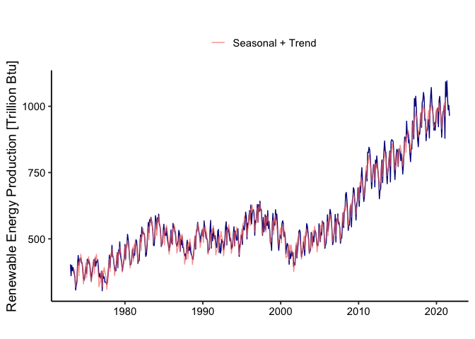
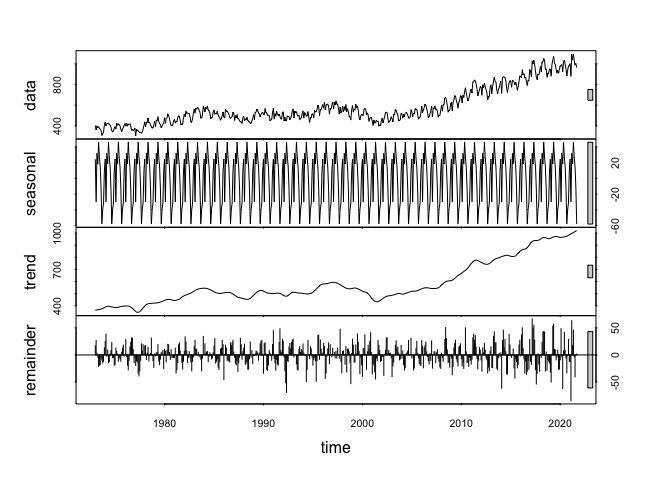

TSA: Trend and Seasonality - Renewable Energy Production Modeling
================
Luana Lima
15/06/2023

## Loading packages and initializing

It’s useful to designate one code chunk to load packages on the
beginning of the file. You can always add to this chunk as needed. But
concentrate the packages needed on only one chunk. By setting message =
FALSE and warning = FALSE, the code will run but nothing will be
printed.

``` r
library(tidyverse)
library(lubridate)
library(forecast)

mytheme <- theme_classic(base_size = 14) +
  theme(axis.text = element_text(color = "black"), 
        legend.position = "top") 
theme_set(mytheme)
```

## Importing data

The data comes from the US Energy Information and Administration and
corresponds to the January 2022 **Monthly** Energy Review. You will work
only with the following column: Total Renewable Energy Production.

The original file was imported and cleaned/wrangled in “ImportData.Rmd”.
Here we are just reading the data already processed and ready to be used
for time series analysis. To import the .csv file we will use
*read.csv()*. This function will store the data as a data frame and has
useful inputs such as

- *file = * : use this input to point to yoru data file. If it’s on the
  same folder as your .Rmd then you only need to write the file name.
  But if it’s on another folder you need to point to the path were file
  is located;
- *header =* : if your file has a header you should set this to TRUE,
  o.w. FALSE;
- *skip =* : if your file has rows explaining the data or any other rows
  on the top that need to be skipped you should just set skip to be
  equal to the number of row that should be skipped before reading the
  data. Mote that if header=TRUE, you should not skip the row with the
  header. The default is *skip=0*;
- *dec =* : define *dec=“.”* or *dec=“,”* depending on how it’s defined
  on your set. The default is “.”.

``` r
#Importing time series data from csv file#
original_data <- read.csv("./Data/Processed/RenewableEnergy.csv")

nobs <- nrow(original_data)
head(original_data,10)
```

    ##          Date Renewable.Energy
    ## 1  1973-01-01          403.981
    ## 2  1973-02-01          360.900
    ## 3  1973-03-01          400.161
    ## 4  1973-04-01          380.470
    ## 5  1973-05-01          392.141
    ## 6  1973-06-01          377.232
    ## 7  1973-07-01          367.325
    ## 8  1973-08-01          353.757
    ## 9  1973-09-01          307.006
    ## 10 1973-10-01          323.453

## Transforming data into time series object

Many of the functions we will use require a time series object. You can
transform your data in a time series using the function *ts()*.

``` r
year1 <- year(original_data$Date[1])
month1 <- month(original_data$Date[1])
ts_original_data <- ts(original_data$Renewable.Energy,start=c(year1,month1),frequency=12) 
ts_original_data
```

    ##           Jan      Feb      Mar      Apr      May      Jun      Jul      Aug
    ## 1973  403.981  360.900  400.161  380.470  392.141  377.232  367.325  353.757
    ## 1974  437.467  399.942  423.474  422.323  427.657  409.281  409.719  386.101
    ## 1975  392.756  368.278  423.490  405.368  421.283  411.622  398.459  368.230
    ## 1976  421.775  396.173  427.044  396.931  415.728  411.555  421.425  398.129
    ## 1977  378.521  304.328  368.966  351.301  356.923  336.485  336.903  335.881
    ## 1978  438.983  391.866  433.459  434.379  475.883  432.628  431.461  408.417
    ## 1979  447.796  390.487  457.799  445.932  489.080  441.683  424.513  409.210
    ## 1980  478.943  424.298  469.134  477.356  517.456  497.768  471.331  429.358
    ## 1981  462.381  427.043  443.808  438.020  480.423  496.995  491.304  454.028
    ## 1982  514.440  489.624  544.724  517.128  525.795  518.974  519.267  483.203
    ## 1983  562.279  523.276  572.853  561.458  581.741  569.493  550.993  528.288
    ## 1984  570.081  535.239  579.040  566.019  593.504  553.321  547.618  524.053
    ## 1985  555.205  511.838  525.002  512.937  542.968  507.330  489.577  475.912
    ## 1986  486.064  479.122  558.538  539.897  545.072  527.412  513.292  482.847
    ## 1987  521.265  452.878  498.782  477.656  509.032  466.873  467.691  448.986
    ## 1988  495.132  446.663  469.098  455.993  486.212  453.891  442.602  437.214
    ## 1989  509.147  461.435  532.715  530.097  562.701  546.136  525.098  513.154
    ## 1990  511.272  508.361  567.935  530.430  525.673  503.363  499.495  497.455
    ## 1991  569.477  465.116  519.109  492.912  540.589  513.638  499.535  512.229
    ## 1992  535.605  449.194  482.783  445.954  455.238  497.881  486.977  491.440
    ## 1993  564.643  477.337  543.313  527.476  537.102  506.688  491.684  502.290
    ## 1994  546.055  474.597  530.492  515.824  494.547  497.431  538.297  484.333
    ## 1995  516.505  478.622  550.407  536.526  533.621  560.146  601.277  582.282
    ## 1996  606.652  571.304  627.925  556.068  594.906  607.617  610.096  594.878
    ## 1997  629.798  563.285  628.987  603.776  642.247  607.803  611.214  566.984
    ## 1998  591.525  534.593  585.345  550.085  606.593  538.492  565.999  537.288
    ## 1999  596.138  533.206  564.564  551.655  610.254  571.951  593.682  547.076
    ## 2000  505.150  499.959  558.005  568.524  558.724  509.114  526.262  503.686
    ## 2001  444.970  404.069  455.780  425.366  435.516  454.616  436.066  447.902
    ## 2002  476.543  428.357  459.464  488.511  527.649  533.572  525.246  469.661
    ## 2003  470.089  437.335  508.207  509.640  557.612  549.082  524.613  501.519
    ## 2004  514.255  474.095  510.691  488.747  522.597  531.784  523.858  502.480
    ## 2005  537.035  489.393  524.494  514.339  567.464  559.554  561.835  514.654
    ## 2006  590.884  529.231  553.158  577.819  611.342  598.581  568.553  531.447
    ## 2007  592.160  488.001  574.760  566.514  594.208  555.751  562.032  542.044
    ## 2008  597.548  542.194  604.394  607.199  668.768  675.460  646.244  599.201
    ## 2009  626.672  545.223  625.284  651.263  693.147  685.792  645.637  618.027
    ## 2010  684.564  622.652  696.585  675.623  732.650  768.894  717.520  677.960
    ## 2011  755.847  718.372  827.115  824.509  845.590  837.331  805.582  755.593
    ## 2012  773.686  695.769  797.381  770.699  812.936  779.418  750.908  720.315
    ## 2013  797.909  711.921  779.308  828.314  869.377  833.354  825.361  752.856
    ## 2014  831.339  714.633  866.713  874.260  871.439  869.655  836.690  768.631
    ## 2015  831.203  773.195  839.624  836.058  829.345  794.427  820.461  794.255
    ## 2016  876.979  865.518  944.085  894.299  904.902  861.625  873.028  825.493
    ## 2017  929.663  876.888 1029.211 1000.658 1038.024  992.546  927.082  872.462
    ## 2018  974.596  920.825 1014.901 1022.044 1052.396 1031.565  946.558  951.261
    ## 2019  949.921  880.451  997.161 1037.089 1071.009 1007.147  995.467  949.779
    ## 2020  979.445  983.569  993.709  922.759 1020.882 1037.679  993.568  953.474
    ## 2021 1002.052  879.302 1092.268 1036.825 1096.106 1031.691  986.802 1003.261
    ##           Sep      Oct      Nov      Dec
    ## 1973  307.006  323.453  337.817  406.694
    ## 1974  353.910  343.703  351.633  376.642
    ## 1975  341.957  368.786  383.196  403.696
    ## 1976  356.984  369.186  351.386  360.834
    ## 1977  328.075  341.368  370.168  400.048
    ## 1978  392.287  379.436  379.078  407.564
    ## 1979  378.903  397.602  414.740  425.109
    ## 1980  401.712  402.564  409.876  448.546
    ## 1981  407.220  416.966  418.476  477.024
    ## 1982  433.748  439.874  469.930  522.930
    ## 1983  476.173  474.251  507.035  587.773
    ## 1984  470.910  479.620  486.110  532.347
    ## 1985  454.274  475.406  499.606  533.960
    ## 1986  472.114  482.113  492.321  532.346
    ## 1987  437.201  442.655  423.208  475.580
    ## 1988  426.312  422.602  448.903  472.132
    ## 1989  487.949  511.060  521.324  533.841
    ## 1990  447.349  460.199  459.565  528.927
    ## 1991  491.722  467.135  467.743  528.581
    ## 1992  458.262  472.679  498.631  545.912
    ## 1993  461.700  468.760  482.149  518.766
    ## 1994  433.624  476.301  482.931  512.711
    ## 1995  499.493  558.496  554.287  585.644
    ## 1996  513.259  568.744  561.307  598.134
    ## 1997  513.212  581.272  526.466  541.767
    ## 1998  487.111  485.978  456.086  553.640
    ## 1999  482.163  456.717  492.906  515.277
    ## 2000  443.376  468.215  482.866  477.785
    ## 2001  396.469  409.918  401.771  449.328
    ## 2002  431.895  445.453  455.854  488.697
    ## 2003  447.111  451.922  460.811  524.525
    ## 2004  479.391  472.887  484.745  557.141
    ## 2005  464.168  475.814  484.901  527.161
    ## 2006  478.075  489.353  515.797  542.004
    ## 2007  483.318  500.596  503.177  547.807
    ## 2008  531.925  552.128  551.737  614.750
    ## 2009  570.906  628.228  642.567  692.188
    ## 2010  641.005  661.275  695.959  739.075
    ## 2011  689.463  719.976  747.922  780.363
    ## 2012  651.074  683.416  687.577  769.695
    ## 2013  707.784  750.915  769.349  806.275
    ## 2014  723.813  774.331  819.067  838.199
    ## 2015  744.600  777.098  828.949  884.658
    ## 2016  791.043  838.230  839.051  945.113
    ## 2017  847.508  902.819  894.114  925.651
    ## 2018  870.109  907.085  911.077  949.759
    ## 2019  909.946  938.857  909.319  948.992
    ## 2020  883.110  937.063  979.210  982.997
    ## 2021  964.228

Note that ts_original_data has information on start, end and frequency.

## Initial Plots

Initial time series plot. We will use the ggplot environment adapted for
time series data by package *forecast*. It tries give better default
graphics and customized choices for time series objects. The equivalent
of *ggplot()* for time series data is *autoplot()* and we will use
*autolayer()* to add more than one series to the same plot.

``` r
autoplot(ts_original_data, color="darkblue") +
    ylab("Renewable Energy Production [Trillion Btu]") +
    xlab("")
```

<!-- -->

## Trend Component

Let’s identify and remove trend component like we leaned in class. Start
by fitting a linear trend model to $Y_t=\beta_0+\beta_1*t+\epsilon_t$.

``` r
#create vector t
t <- c(1:nobs)

#combine t and original into one data frame
data <- data.frame("t"=t,"original"=original_data$Renewable.Energy)

#Fit a linear trend to TS, lm function needs a data frame object
linear_trend_model=lm(original~t,data)  
summary(linear_trend_model)
```

    ## 
    ## Call:
    ## lm(formula = original ~ t, data = data)
    ## 
    ## Residuals:
    ##      Min       1Q   Median       3Q      Max 
    ## -230.488  -57.869    5.595   62.090  261.349 
    ## 
    ## Coefficients:
    ##              Estimate Std. Error t value Pr(>|t|)    
    ## (Intercept) 323.18243    8.02555   40.27   <2e-16 ***
    ## t             0.88051    0.02373   37.10   <2e-16 ***
    ## ---
    ## Signif. codes:  0 '***' 0.001 '**' 0.01 '*' 0.05 '.' 0.1 ' ' 1
    ## 
    ## Residual standard error: 96.93 on 583 degrees of freedom
    ## Multiple R-squared:  0.7025, Adjusted R-squared:  0.702 
    ## F-statistic:  1377 on 1 and 583 DF,  p-value: < 2.2e-16

``` r
#first coefficient is the intercept term or beta0
beta0=as.numeric(linear_trend_model$coefficients[1])  

#second coefficient is the slope or beta1
beta1=as.numeric(linear_trend_model$coefficients[2])  
```

Note that coefficients for the linear trend, beta 1 have a p-value
greater than 0.05, which means the coefficient is not significant. Let’s
visualize this.

``` r
#create linear trend series
linear_trend <- (beta0+beta1*t)
ts_linear_trend <- ts(linear_trend,start=c(year1,month1),frequency=12) 

#visualize the trend on observed data
autoplot(ts_original_data, color="darkblue") +
  autolayer(ts_linear_trend,series="Linear Trend") +
  ylab("Renewable Energy Production [Trillion Btu]") +
  xlab("") +
  labs(color="")
```

<!-- -->

\##Smoothing out the trend

Since the overall linear trend was not significant, let’s try the
rolling average method. We have monthly data so our frequency is 12. We
will use a moving average of order 12 to remove the seasonal influence
from trend analysis.

``` r
order <- 6 #frequency = 12
smooth_trend <- array(NA,nobs)
for(t in (order+1):(nobs)){
  smooth_trend[t] = mean(original_data$Renewable.Energy[(t-order+1):(t+order)])
}
  
ts_smooth_trend <- ts(smooth_trend,start=c(year1,month1),frequency=12) 

autoplot(ts_original_data, col="darkblue") +
  autolayer(ts_linear_trend,series="Linear Trend" ) +
  autolayer(ts_smooth_trend,series="Smooth Trend" ) +
  ylab("Renewable Energy Production [Trillion Btu]") +
  xlab("") +
  labs(color="")
```

<!-- -->

## Detrend Series

Now let’s remove the rolling average trend from the original series.

``` r
#Create detrended series from linear trend
detrend_linear <- original_data$Renewable.Energy-(beta0+beta1*data$t)   
year1 <- year(original_data$Date[1])
month1 <- month(original_data$Date[1])
ts_detrend_linear <- ts(detrend_linear,start=c(year1,month1),frequency=12) 

#Create detrended series from rolling average trend - that the we will use
detrend_smooth <- original_data$Renewable.Energy - smooth_trend
ts_detrend_smooth <- ts_original_data-ts_smooth_trend

autoplot(ts_original_data, col="darkblue") +
  autolayer(ts_detrend_smooth,series="Detrended Series" ) +
  ylab("Renewable Energy Production [Trillion Btu]") +
  xlab("") +
  labs(color="")
```

<!-- -->

## Seasonal Component

Now let’s shift attention to the seasonal component. We will fit a
Seasonal Means Model to our detrended data.

``` r
#First create the seasonal dummies
dummies <- seasonaldummy(ts_detrend_smooth)  #this function only accepts ts object

#Then fit a linear model to the seasonal dummies
seas_means_model=lm(detrend_smooth~dummies)
summary(seas_means_model)
```

    ## 
    ## Call:
    ## lm(formula = detrend_smooth ~ dummies)
    ## 
    ## Residuals:
    ##     Min      1Q  Median      3Q     Max 
    ## -82.845 -13.565  -0.292  14.095  69.350 
    ## 
    ## Coefficients:
    ##             Estimate Std. Error t value Pr(>|t|)    
    ## (Intercept)    8.867      3.196   2.775 0.005709 ** 
    ## dummiesJan    14.838      4.519   3.283 0.001090 ** 
    ## dummiesFeb   -39.277      4.519  -8.691  < 2e-16 ***
    ## dummiesMar    22.958      4.519   5.080 5.15e-07 ***
    ## dummiesApr     8.631      4.543   1.900 0.057964 .  
    ## dummiesMay    35.794      4.543   7.878 1.73e-14 ***
    ## dummiesJun    17.657      4.543   3.886 0.000114 ***
    ## dummiesJul     5.616      4.519   1.243 0.214464    
    ## dummiesAug   -22.652      4.519  -5.012 7.22e-07 ***
    ## dummiesSep   -67.708      4.519 -14.982  < 2e-16 ***
    ## dummiesOct   -49.018      4.519 -10.847  < 2e-16 ***
    ## dummiesNov   -40.653      4.519  -8.996  < 2e-16 ***
    ## ---
    ## Signif. codes:  0 '***' 0.001 '**' 0.01 '*' 0.05 '.' 0.1 ' ' 1
    ## 
    ## Residual standard error: 22.14 on 561 degrees of freedom
    ##   (12 observations deleted due to missingness)
    ## Multiple R-squared:  0.6768, Adjusted R-squared:  0.6705 
    ## F-statistic: 106.8 on 11 and 561 DF,  p-value: < 2.2e-16

``` r
#Look at the regression coefficient. These will be the values of Beta

#Store regression coefficients
beta_int=seas_means_model$coefficients[1]
beta_coeff=seas_means_model$coefficients[2:12]
```

``` r
#compute seasonal component
seas_component=array(0,nobs)
for(i in 1:nobs){
  seas_component[i]=(beta_int+beta_coeff%*%dummies[i,])
}

#Transform into a ts object
ts_seasonal_component <- ts(seas_component,start=c(year1,month1),frequency=12) 

#Understanding what we did
autoplot(ts_detrend_smooth,series="Observed - Trend") +
  autolayer(ts_seasonal_component,series="Seasonal Component",alpha=0.5) +
  ylab("Renewable Energy Production [Trillion Btu]") +
  xlab("") +
  labs(color="")
```

<!-- -->

## Combine Seasonal and Trend

Now let’s add seasonal and trend component and see how it maps onto
orignal data series.

``` r
#Create seasonal + trend object
ts_seasonal_trend <- ts_seasonal_component + ts_smooth_trend 

#Understanding what we did
autoplot(ts_original_data, color="darkblue") +
  autolayer(ts_seasonal_trend,series="Seasonal + Trend", alpha=0.7) +
  ylab("Renewable Energy Production [Trillion Btu]") +
  xlab("") +
  labs(color="")
```

<!-- -->

## Decompose and Forecast

Now that you understand the principle, there are functions in R that
will automatically decompose your time series data like the
*decompose()* and the *stl()* from the *stats* package. This functions
only take time series objects. They will decompose your time series into
three components: trend, seasonal and random. This is similar to what we
did in the script, but in a more automated way. The random component is
the time series without seasonal and trend component.

``` r
decompose <- decompose(ts_original_data,type="multiplicative") 
plot(decompose)
```

<!-- -->

``` r
decompose <- stl(ts_original_data,s.window="periodic")
plot(decompose)
```

<!-- -->

## Forecast with seasonal trend model

``` r
fit <- stl(ts_original_data,s.window="periodic")

original_forecast <- forecast(fit, h=48)

autoplot(original_forecast) + 
  ylab("Renewable Energy Production [Trillion Btu]") + 
  ggtitle("Forecast with Seasonal Trend Model")
```

<!-- -->
